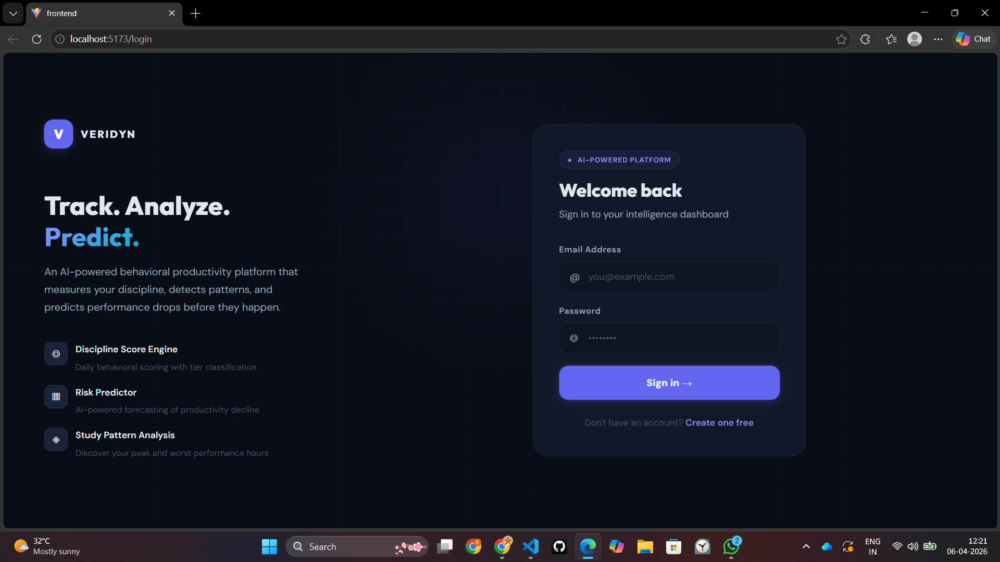
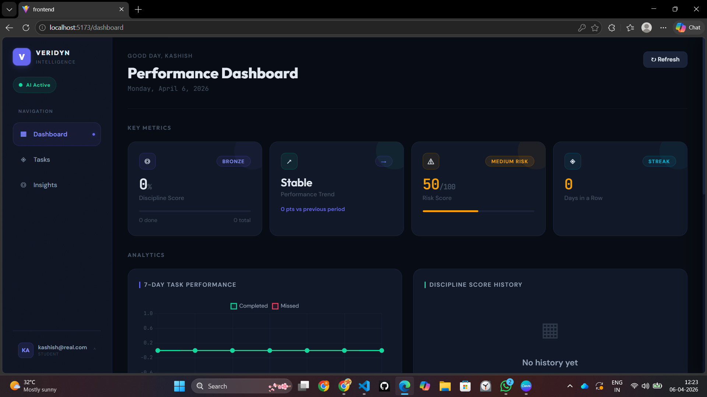
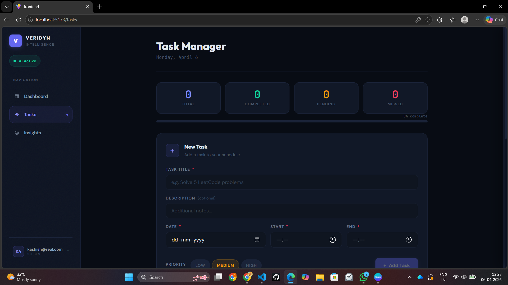
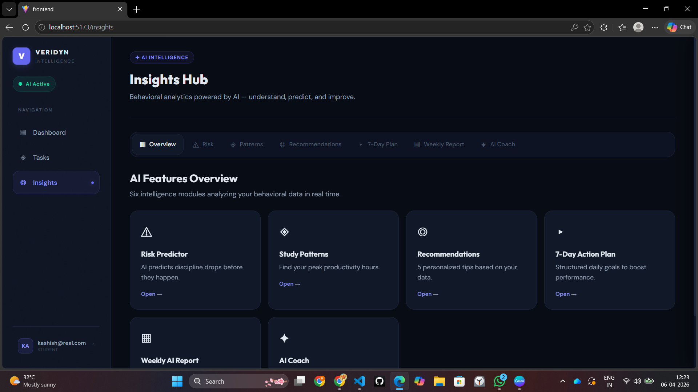

# VERIDYN — AI Behavioral Productivity Intelligence Platform

> *"Veri" (truth) + "Dynamic" (adaptability) — know yourself, improve consistently.*
<div align="center">
  
  
</div>
<div align="center">
  
  
</div>

[](https://veridyn-five.vercel.app)
[](https://nodejs.org)
[](https://react.dev)
[](https://mongodb.com)

---

## What is VERIDYN?

VERIDYN is a full-stack AI productivity platform that goes beyond simple task tracking. It analyzes your behavioral patterns over time — discipline score, performance tier, volatility, risk score, and streaks — to give you actionable intelligence about how you actually work, not just what you planned to do.

Built as a flagship personal project targeting software engineering internships.

---

## Live Demo

🔗 **[veridyn-five.vercel.app](https://veridyn-five.vercel.app)**

> Create an account and start logging study sessions — the heatmap and streak system update in real time.

---

## Features

### 🧠 AI Coaching Layer
- **AI Productivity Coach** — Groq-powered (LLaMA 3.1 70B) chat coach with your live data as context
- **Risk Predictor** — predicts discipline drops before they happen using streak, volatility, and trend analysis
- **Study Pattern Analyzer** — detects your best and worst productivity hours automatically
- **AI Recommendations** — personalized suggestions based on behavioral history

### 📊 Behavioral Analytics
- **Discipline Score** — completion rate × 100, updated daily
- **Performance Tiers** — Elite (85%+), Gold (70–84%), Silver (50–69%), Bronze (<50%)
- **Volatility Score** — standard deviation of your discipline scores (Stable / Moderate / High)
- **Risk Score** — composite score from streak gaps, declining trend, and missed goals
- **Weekly Performance** — this week vs last week comparison with trend direction

### ⏱ Study Timer + Heatmap
- Built-in start/pause/stop study timer
- Sessions auto-save to your daily log
- GitHub-style **Productivity Heatmap** — squares color up based on goal completion rate
- **Streak system** — consecutive days of hitting your daily study goal
- 🪙 **Streak coin celebration** — animated popup when you hit your daily goal

### ✅ Task Management
- Create tasks with title, description, date, start/end time, priority
- Mark complete, delete, filter by status
- Auto-detects missed tasks based on current time
- Real-time completion progress bar

### 👤 Profile System
- Slide-out profile panel with 6 sub-views
- Edit display name and role
- Change password with validation
- Preferences — set daily study goal (drives heatmap + streaks), timezone, theme
- Help Center, What's New changelog, Keyboard Shortcuts

### 📱 Fully Responsive
- Desktop: fixed sidebar navigation
- Mobile: bottom tab bar with glass blur effect
- iOS safe area support

---

## Tech Stack

| Layer | Technology |
|---|---|
| Frontend | React 18, React Router, Chart.js, Vite |
| Backend | Node.js, Express.js |
| Database | MongoDB Atlas, Mongoose |
| AI Provider | Groq (LLaMA 3.1 70B) — Anthropic fallback |
| Auth | JWT (JSON Web Tokens) |
| Deployment | Vercel (frontend) + Render (backend) |
| Styling | Custom CSS — Obsidian Intelligence dark theme |

---

## Project Structure

```
veridyn/
├── frontend/
│   ├── src/
│   │   ├── components/
│   │   │   ├── Navbar.jsx              # Sidebar + mobile bottom bar
│   │   │   ├── ProfilePanel.jsx        # Right-side slide panel
│   │   │   ├── StudyTimer.jsx          # Start/stop study timer
│   │   │   ├── StreakCelebration.jsx   # Coin popup animation
│   │   │   └── ProductivityCalendar.jsx # GitHub-style heatmap
│   │   ├── pages/
│   │   │   ├── Dashboard.jsx           # Performance overview
│   │   │   ├── Tasks.jsx               # Task manager
│   │   │   └── Insights.jsx            # AI analytics hub
│   │   ├── hooks/
│   │   │   └── useDashboardData.js     # All dashboard API calls
│   │   └── styles/                     # Per-page CSS modules
│
├── backend/
│   ├── models/
│   │   ├── User.js
│   │   ├── Task.js
│   │   ├── StudyLog.js                 # Timer sessions + chapter logs
│   │   └── Subject.js
│   ├── routes/
│   │   ├── auth.routes.js
│   │   ├── task.routes.js
│   │   ├── studyLog.routes.js          # Timer session endpoints
│   │   ├── stats.routes.js             # 8 analytics endpoints
│   │   ├── user.routes.js
│   │   └── ai.routes.js
│   ├── middleware/
│   │   ├── auth.middleware.js
│   │   └── rateLimiter.js
│   └── server.js
```

---

## API Endpoints

### Auth
```
POST   /api/auth/register
POST   /api/auth/login
```

### Tasks
```
GET    /api/tasks
POST   /api/tasks
PATCH  /api/tasks/:id
DELETE /api/tasks/:id
GET    /api/tasks/next
```

### Study Timer
```
POST   /api/study-logs/session      # Save a timer session
GET    /api/study-logs/today        # Today's progress
GET    /api/study-logs/heatmap      # Full heatmap data
```

### Analytics (Stats)
```
GET    /api/stats/dashboard         # Main metrics summary
GET    /api/stats/weekly            # Last 7 days breakdown
GET    /api/stats/weekly-performance # This week vs last week
GET    /api/stats/insights          # Full behavioral analytics
GET    /api/stats/history           # Paginated session history
GET    /api/stats/longest-streak    # Current + all-time streak
GET    /api/stats/monthly-aggregate # Month-by-month totals
GET    /api/stats/calendar?year=    # Heatmap data for a year
```

### User
```
PUT    /api/users/profile           # Update name + role
PUT    /api/users/change-password   # Change password
```

---

## Getting Started (Local Setup)

### Prerequisites
- Node.js 18+
- MongoDB Atlas account (free tier works)
- Groq API key (free at [console.groq.com](https://console.groq.com))

### 1. Clone the repo
```bash
git clone https://github.com/YOUR_USERNAME/veridyn.git
cd veridyn
```

### 2. Backend setup
```bash
cd backend
npm install
```

Create `.env`:
```env
PORT=5000
MONGO_URI=your_mongodb_atlas_connection_string
JWT_SECRET=your_jwt_secret_key
GROQ_API_KEY=your_groq_api_key
```

Start backend:
```bash
npm run dev
```

### 3. Frontend setup
```bash
cd frontend
npm install
```

Create `.env`:
```env
VITE_API_URL=http://localhost:5000
```

Start frontend:
```bash
npm run dev
```

### 4. Open in browser
```
http://localhost:5173
```

---

## Key Algorithms

**Discipline Score**
```
score = (completed_tasks / total_tasks) × 100
```

**Volatility**
```
volatility = std_deviation(discipline_scores_last_30_days)
```

**Risk Score**
```
risk = (missed_days_last_7 / 7) × 100
```

**Streak**
```
streak = consecutive days where completionRate ≥ 1.0
```

**Heatmap Color Intensity**
```
completionRate 0.00      → empty (dark)
completionRate 0.01–0.25 → level 1
completionRate 0.25–0.50 → level 2
completionRate 0.50–0.75 → level 3
completionRate 0.75+     → level 4 (full glow)
```

---

## Screenshots

> Dashboard — Performance Overview

> Tasks — Task Manager with priority system

> Insights Hub — AI behavioral analytics

> Mobile — Bottom navigation bar

*(Add screenshots to `/screenshots` folder and link here)*

---

## What I Learned Building This

- Designing a full REST API from scratch with Express + MongoDB
- JWT authentication flow with protected routes
- Real-time data aggregation — building analytics from raw logs
- Integrating LLM APIs (Groq / Anthropic) with user context injection
- Building a GitHub-style contribution heatmap from date-indexed data
- Deploying a split frontend/backend architecture (Vercel + Render)
- Mobile-first responsive design with iOS safe area handling

---

## Roadmap

- [ ] LeetCode API integration — pull LC submissions into heatmap
- [ ] PWA support — installable on mobile
- [ ] Daily study reminders (push notifications)
- [ ] Light theme
- [ ] Team/friend leaderboard

---

## Author

**Kashish**
3rd Year B.Tech Computer Science — Kalam Institute of Technology

[](https://github.com/YOUR_USERNAME)
[](https://linkedin.com/in/YOUR_PROFILE)

---

## License

MIT License — feel free to fork and build on this.

---

*Built with obsessive attention to detail. Every pixel, every algorithm, every endpoint — intentional.*